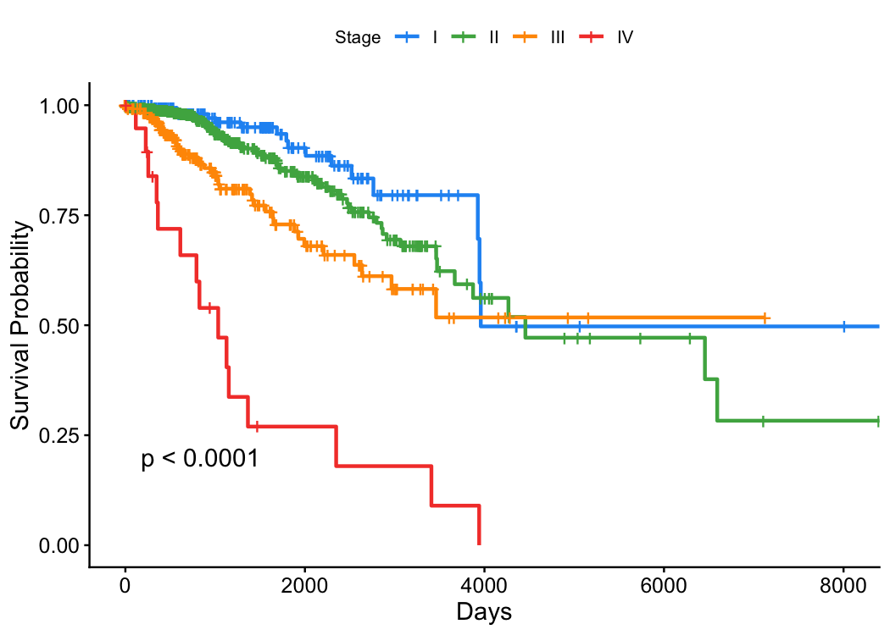
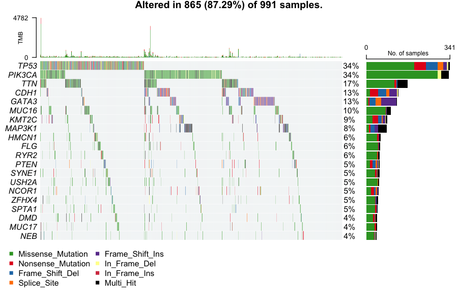
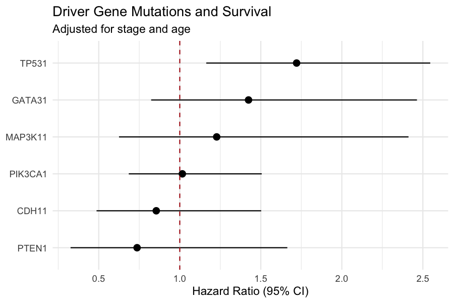

# About This Project

## What it is

This project builds an end-to-end analytical pipeline for the TCGA-BRCA dataset — 1,098 breast cancer patients with matched clinical, somatic mutation, and RNA-seq data from the NCI Genomic Data Commons. Raw genomic data flows through a structured transformation layer into a set of analysis-ready tables, then into a fully reproducible statistical analysis covering survival, mutation landscape, and multivariate Cox regression.

The goal was to bridge two worlds that rarely talk to each other: **bioinformatics** (where the data lives) and **data engineering** (where the infrastructure lives). Most genomic analyses are done entirely in R scripts with no transformation layer, no schema contracts, and no documentation. This project applies modern data engineering practices — dbt, DuckDB, schema versioning, column-level tests — to a domain that has historically ignored them.

---

## Why this stack

### R + TCGAbiolinks for extraction

The NCI GDC has its own R client (`TCGAbiolinks`) that handles authentication, file discovery, and download. There is no mature Python equivalent for the full clinical + MAF + RNA-seq workflow. R was the right tool.

### DuckDB as the storage layer

Most bioinformatics pipelines write intermediate results to CSV or RDS files and pass them between scripts by path. This creates implicit dependencies, no schema enforcement, and no queryability. DuckDB gives us:

- A single file that holds all three data types (clinical, mutations, expression)
- SQL queryability from both R (`DBI`) and Python (`dbt-duckdb`)
- Fast analytical queries on columnar data without a server
- A clean raw → staging → marts schema separation

The tradeoff is that DuckDB has a single-writer lock — you can't have R and dbt connected simultaneously. In practice this is fine: extraction writes, then dbt transforms, then R reads.

### dbt for transformation

Putting transformation logic in dbt instead of R means:

- Every transform is documented and version-controlled as SQL
- Column lineage is tracked — you can see exactly which raw column produced which mart column
- Tests (`not_null`, `unique`) run automatically and fail loudly
- The DAG is visual and explorable

The alternative — doing all cleaning in R before analysis — mixes concerns. dbt keeps "what does the data look like" separate from "what does the analysis say."

### Quarto for analysis

Quarto renders R code + prose + plots into a self-contained HTML file that can be hosted as a static page. The analysis is fully reproducible: clone the repo, run the pipeline, re-render the QMD, get the same output. No Jupyter server, no Shiny server, no cloud compute needed.

---

## The data

TCGA-BRCA is one of the most comprehensively characterized cancer cohorts in existence:

- **1,098 patients** with primary breast adenocarcinoma
- **Clinical data**: staging (AJCC I–IV), age, vital status, follow-up time, histology, laterality
- **Somatic mutations**: ~90,000 variants from whole-exome sequencing, called by MuTect2, stored in MAF format
- **RNA-seq**: STAR-Counts gene expression for ~60,000 genes per sample

The data is open access (de-identified) and freely available from the GDC. No IRB required.

---

## What the analysis shows

### Stage is the dominant prognostic factor

Kaplan-Meier curves stratified by AJCC stage show highly significant separation (log-rank p < 0.0001). Stage IV patients have a median overall survival of ~1,500 days vs. Stage I/II patients who largely do not reach median survival within the follow-up window — meaning more than half are still alive at last contact.



In multivariate Cox regression, Stage IV carries a hazard ratio of ~10x vs Stage I after adjusting for age and TMB. This is expected and validates the pipeline — if stage didn't predict survival in BRCA, something would be wrong with the data.

### TMB does not predict survival in univariate analysis — and that's correct

Tumor mutation burden (TMB) is the count of coding somatic mutations per megabase of exome. In cancers like melanoma and lung adenocarcinoma, high TMB predicts better response to immunotherapy and better survival. The logic: more mutations → more neoantigens → more immune recognition.

BRCA is **immunologically cold**. The tumor microenvironment is poorly infiltrated by cytotoxic T cells, and PD-L1 expression is low except in triple-negative subtype. TMB doesn't trigger immune clearance the way it does in hot tumors. The univariate log-rank p-value of 0.46 is biologically correct — this is a negative result that tells us something real.

In multivariate Cox regression, TMB does show a small independent effect (HR ~1.035 per unit, p = 0.013) after adjusting for stage and age. This is consistent with the literature: TMB has a subtle prognostic signal in BRCA that only emerges when the dominant stage effect is controlled for.

### Mutation landscape

The top mutated genes — TP53 (34%), PIK3CA (34%), CDH1 (13%), GATA3 (13%) — are exactly what the TCGA BRCA paper reported in 2012. This validates the MAF processing pipeline.



The SNV class distribution is dominated by C>T transitions, consistent with **APOBEC mutagenesis** (cytidine deaminase activity, a known mutational process in BRCA) and age-related deamination. This is visible in the MAF summary plot.

BRCA has low median TMB (~1 mut/Mb), consistent with it being a non-hypermutated cancer type. For comparison, melanoma median is ~10–15 mut/Mb and microsatellite-unstable colorectal cancer can exceed 100 mut/Mb.

### No individual driver gene reaches significance in Cox regression

After adjusting for stage and age, no single driver gene mutation (TP53, PIK3CA, CDH1, GATA3) reaches significance as an independent predictor of survival.

 This is not surprising — these genes are **subtype markers** rather than independent prognostic factors. TP53 mutation marks the basal-like subtype, which has poor prognosis, but that prognosis is largely captured by stage. In a multivariate model with stage already in it, the additional TP53 signal shrinks.

---

## What could be extended

- **Molecular subtyping**: PAM50 subtype classification from RNA-seq (Luminal A/B, HER2-enriched, Basal-like, Normal-like) would likely explain more survival variance than TMB
- **Mutational signatures**: SBS signature decomposition using `MutationalPatterns` would quantify APOBEC vs. BRCA1/2-deficiency vs. aging contributions per patient
- **Bayesian survival model**: `rstanarm` Cox regression with weakly informative priors and posterior credible intervals, rather than frequentist p-values
- **Multi-cancer**: Parameterize the extraction script by GDC project ID and run across all 33 TCGA cancer types, partitioning by cancer type in DuckDB
- **Differential expression**: DESeq2 on the RNA-seq data stratified by TP53 mutation status or stage

---

## Reproducibility

```bash
# 1. Extract
cd extraction && Rscript extract_tcga.R

# 2. Transform
cd transform && uv run dbt run --profiles-dir .

# 3. Analyze
quarto render visualize/visualize.qmd

# 4. Build docs
make all
```

All R packages are pinned via `renv.lock`. The Python environment is pinned via `uv.lock`. The DuckDB file is the only artifact not in version control (it's ~500MB). Everything else needed to reproduce the analysis is in the repo.
