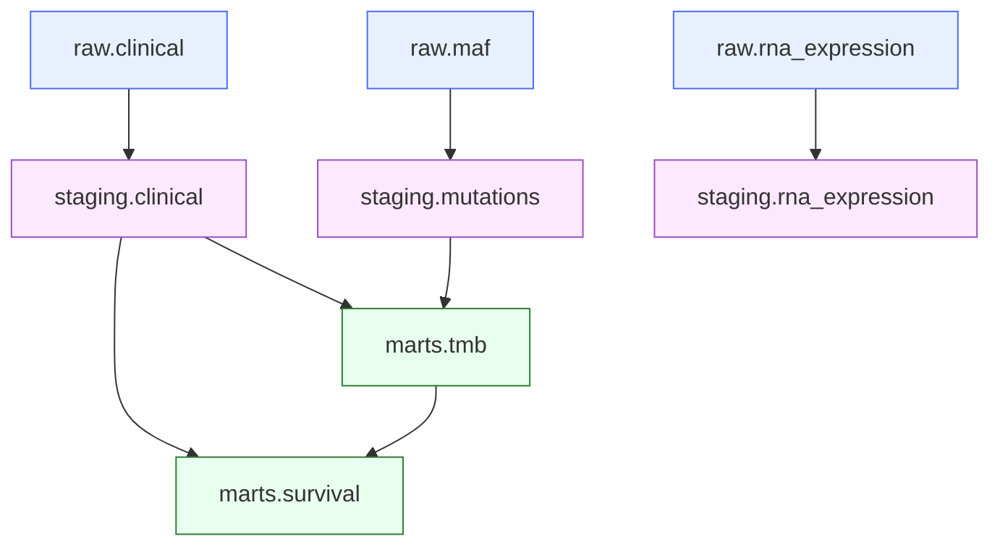

# dbt Documentation

The full dbt docs site includes the lineage DAG, column-level descriptions, and test results for all staging and mart models.

[**→ Open dbt Docs**](https://stavgrossfeld.github.io/tcga-dbt/dbt-docs/index.html){ .md-button .md-button--primary target="_blank" }

---

## What's inside

- **Lineage graph** — visual DAG from raw sources through staging to marts
- **Model descriptions** — purpose and SQL for each model
- **Column descriptions** — type, description, and tests for every column
- **Test results** — not_null and unique constraint coverage

## Models at a glance

