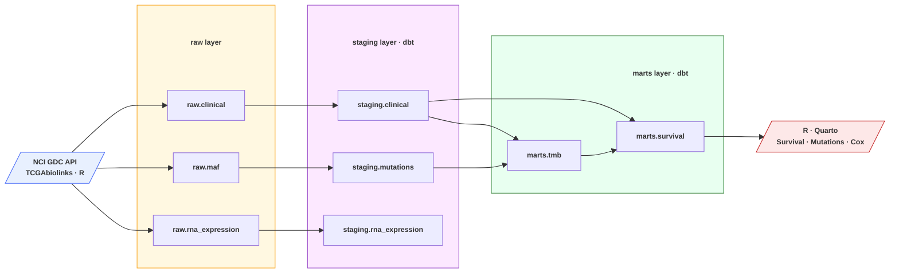

# TCGA-BRCA Pipeline

**Bioinformatics meets data engineering.** Clinical, somatic mutation, and RNA-seq data for 1,098 breast cancer patients — extracted from the NCI GDC, transformed with dbt on DuckDB, and analyzed in R.

## Quick Links

-   :material-chart-line: **[Analysis](https://stavgrossfeld.github.io/tcga-dbt/visualization/index.html){target=_blank}**

    Survival curves, oncoplot, multivariate Cox regression

-   :material-database: **[dbt Docs](https://stavgrossfeld.github.io/tcga-dbt/dbt-docs/index.html){target=_blank}**

    Interactive data catalog and lineage DAG

-   :material-github: **[GitHub](https://github.com/stavgrossfeld/tcga-dbt){target=_blank}**

    Source code and reproducibility instructions

## Pipeline Overview

## Key Findings

| Finding | Result |
|---|---|
| Stage vs survival | Log-rank p < 0.0001, Stage IV HR = 10.3x |
| Top mutated genes | TP53 34%, PIK3CA 34%, CDH1 13% |
| TMB univariate | Not significant (p = 0.46) — consistent with BRCA's immunologically cold phenotype |
| TMB multivariate | Independent predictor after adjusting for stage (HR = 1.035, p = 0.013) |

## Stack

| Layer | Tool |
|---|---|
| Extraction | R, TCGAbiolinks, GDC Transfer Tool |
| Storage | DuckDB |
| Transformation | dbt-duckdb |
| Analysis | R, survival, maftools, ggplot2 |
| Publishing | Quarto, MkDocs Material, GitHub Pages |
