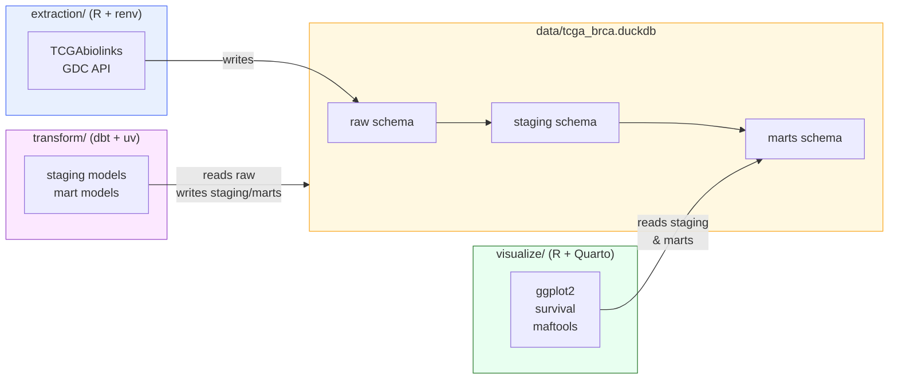

# Pipeline Overview

The pipeline has three independent stages connected by a shared DuckDB file.

## Architecture



## Contract

The only dependency between stages is the DuckDB file at `data/tcga_brca.duckdb`. It must contain:

| Table | Written by | Read by |
|---|---|---|
| `raw.clinical` | extraction | dbt, R |
| `raw.maf` | extraction | dbt, R |
| `raw.rna_expression` | extraction | dbt, R |
| `staging.*` | dbt | R |
| `marts.*` | dbt | R |

## Running the full pipeline

```bash
# Step 1 — extract
cd extraction
Rscript extract_tcga.R

# Step 2 — transform
cd transform
uv run dbt run --profiles-dir .

# Step 3 — analyze
quarto render visualize/visualize.qmd
```

Or use the Makefile:

```bash
make all
```
